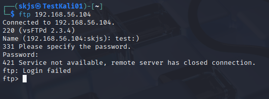
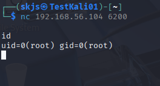

# metasploitable-nmap-servicescan-report

Metasploitableのスキャン結果と考察

---

CVE-2011-2523 vsftpd バックドア攻撃の再現

Metasploitableに搭載されたvsftpd 2.3.4の既知脆弱性を再現。  
FTPログインに特定ユーザ名　test:)　を使用することでバックドアが起動し、  
ポート 6200/tcp 経由でroot shellを取得できる。

　 攻撃スクリーンショット：

- FTPでバックドアトリガー：  
  

- ncで接続し uid=0(root) を確認：  
  
